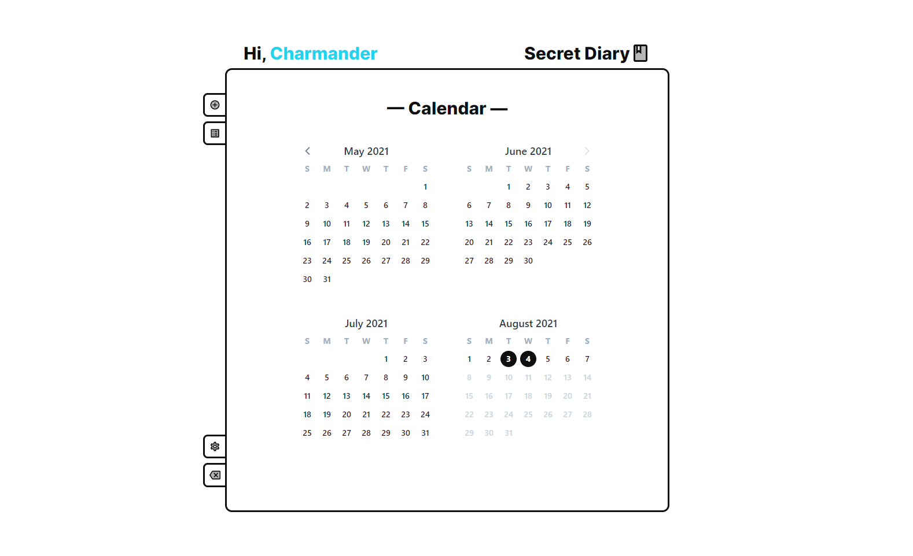

<!-- PROJECT LOGO -->
<br />
<p align="center">
  <a href="github.com/developerrahulofficial/crush-diary">
    
  </a>

  <h3 align="center">Crush Diary</h3>

  <p align="center">

    <br />
    <a href="https://secret-diary.vercel.app/">View Demo</a>
    ·
    <a href="https://github.com/zernonia/secret-diary/issues">Report Bug</a>
    ·
    <a href="https://github.com/zernonia/secret-diary/issues">Request Feature</a>
  </p>
</p>



## 🚀 Features

- 🔨 No installations required
- 🔒 Data can be hosted on your own [Supabase](https://supabase.io/) Instance
- 🚪 Phone login, required OTP for initial Sign Up
- 👀 No Sensitive info required
- 🤚 Move your loving diary to Web


## 🌎 Local Development

### Prerequisites

Yarn

- ```sh
  npm install --global yarn
  ```

### Development

1. Clone the repo
   ```sh
   git clone https://github.com/zernonia/secret-diary.git
   ```
2. Install NPM packages
   ```sh
   yarn install
   ```
3. Run Development instance
   ```sh
   yarn dev
   ```


## 📧 Contact

Developer Rahul  - rahulsahnicodes@gmail.com
